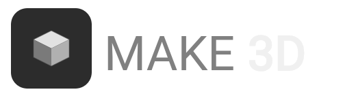

<div align="center">



<br/>
<br/>

<strong>Transform any SVG into a stunning 3D model. Customize, preview, and export in seconds.</strong>

<br/>
<br/>

[](https://nextjs.org)
[](https://threejs.org)
[](https://www.typescriptlang.org)
[](https://tailwindcss.com)
[](./LICENSE)

</div>

<br/>

Make3D is a free, open-source browser tool that converts SVG files into interactive 3D models. No installs, no accounts, no exports to a third-party server. Everything runs locally in your browser.

---

## Features

| Category | What you can do |
|---|---|
| **Geometry** | Control extrusion depth and bevel (thickness, size, smoothness) |
| **Materials** | Choose from presets: Matte Metal, Chrome, Glass, Plastic, Ceramic, Gold, and more |
| **Color** | Override all SVG colors with a single custom color picker |
| **Environment** | Switch between HDRI presets or upload your own image for reflections |
| **Background** | Pick any background color, or go black for a studio look |
| **Vibe Mode** | Toggle bloom and glow for a dreamy, editorial render |
| **Compare** | Drag a before/after slider to compare the flat SVG with the 3D result |
| **Auto Rotate** | Enable auto-rotation with adjustable speed |
| **Export** | Download as PNG (transparent), STL, GLB, or GLTF |
| **Video** | Record an MP4 or GIF of the rotating model |
| **Get Code** | Copy a self-contained HTML file using Three.js CDN, no npm needed |

---

## Quick Start

```bash
# Clone the repo
git clone https://github.com/your-username/make3d.git
cd make3d

# Install dependencies
npm install

# Start the dev server
npm run dev
```

Open [http://localhost:3000](http://localhost:3000) in your browser.

---

## How to Use

1. Drop an SVG file onto the canvas, click to upload, or paste SVG code directly
2. Adjust depth, bevel, and material settings in the right panel
3. Use the Compare slider to see before and after side by side
4. Export as PNG, STL, GLB, GLTF, MP4, or GIF
5. Click **Get Code** to copy a ready-to-run HTML file you can open in any browser

---

## Project Structure

```
make3d/
├── app/                  # Next.js App Router pages and layout
├── components/
│   ├── edit/             # Control panels, export, code generation
│   ├── modals/           # Video result modal
│   ├── previews/         # 3D canvas and model rendering
│   └── ui/               # Shared UI primitives
├── hooks/                # Custom React hooks
├── lib/                  # Store (Zustand), exporters, constants, utilities
├── public/               # Static assets and HDRI textures
└── styles/               # Global CSS
```

---

## Tech Stack

| Layer | Library |
|---|---|
| Framework | Next.js 15 (App Router, Turbopack) |
| 3D Rendering | Three.js, React Three Fiber, Drei |
| State | Zustand |
| Animation | Framer Motion |
| Styling | Tailwind CSS v4 |
| Language | TypeScript |

---

## Export Formats

| Format | Details |
|---|---|
| **PNG** | Transparent background, rendered at 3x resolution |
| **STL** | Standard mesh format for 3D printing and CAD tools |
| **GLB** | Binary GLTF, includes materials and textures |
| **GLTF** | Text-based GLTF with separate texture files |
| **MP4** | Recorded rotating video, configurable duration |
| **GIF** | Animated GIF of the rotating model |

---

## Get Code Feature

The **Get Code** panel generates a complete, standalone HTML file you can copy and open directly in any browser. It uses Three.js from a CDN via an import map - no npm, no build step. The generated code stays in sync with all your current settings including material, depth, bevel, colors, and bloom.

---

## License

MIT License. See [LICENSE](./LICENSE) for details.

---

## Contributing

Pull requests are welcome. For major changes, open an issue first to discuss what you would like to change. Please read [CONTRIBUTING.md](./CONTRIBUTING.md) before submitting.

---

<div align="center">

If you find Make3D useful, give it a star and share it with others.

</div>
